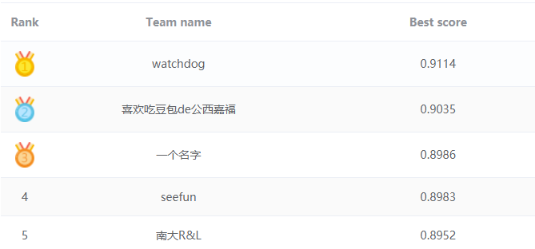

# iQIYI_VID_FACE_2019

Win the Third Place in [2019 iQIYI Celebrity Video Identification Challenge](<http://challenge.ai.iqiyi.com/detail?raceId=5c767dc41a6fa0ccf53922e7>)  with mAP **0.8986**




Member: [LegenDong](<https://github.com/LegenDong>), [edward3862](<https://github.com/edward3862>), [huangzh13](<https://github.com/huangzh13>), [CarmenJi](<https://github.com/CarmenJi>)

## Environment

- Python 3.6+
- PyTorch 1.0.1

## Citation

> ```
> @inproceedings{dong2019deepmef,
>   title={DeepMEF: A Deep Model Ensemble Framework for Video Based Multi-modal Person Identification},
>   author={Dong, Chuanqi and Gu, Zheng and Huang, Zhonghao and Ji, Wen and Huo, Jing and Gao, Yang},
>   booktitle={Proceedings of the 27th ACM International Conference on Multimedia},
>   pages={2531--2534},
>   year={2019},
>   organization={ACM}
> }
> ```

## Reference

[NAN](<https://github.com/YirongMao/NAN>)

[pytorch-template](<https://github.com/victoresque/pytorch-template>)

[pretrained-models.pytorch](<https://github.com/Cadene/pretrained-models.pytorch>)